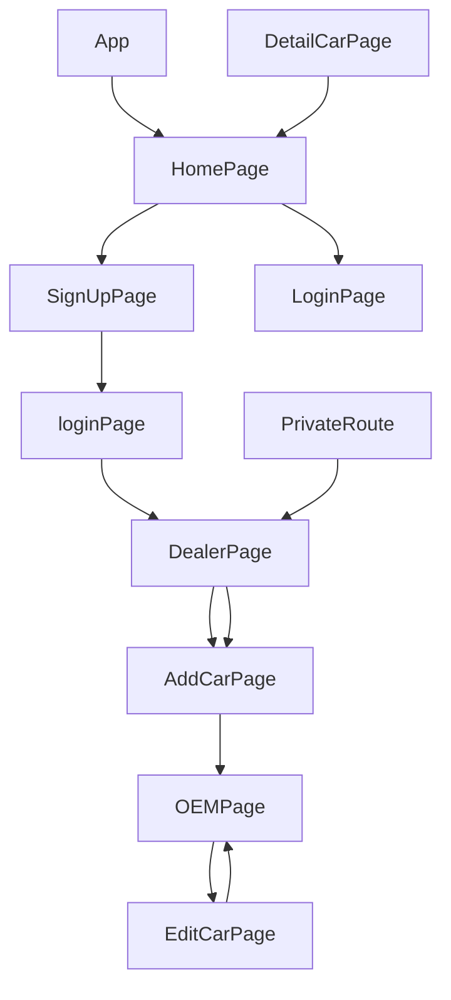

> 💻 PROJECT NAME ✨ => 💻UsedCars /Lets Buy your
Second-Hand Cars 🧑‍💻 :-
 

---

## 🔗 Profile Links✨

| Resume | Github                                                                                                                                   | Linkedin                                                                                                                                                            | Portfolio                                                                                                                                    |
| ------------- | ---------------------------------------------------------------------------------------------------------------------------------------- | ------------------------------------------------------------------------------------------------------------------------------------------------------------------- | -------------------------------------------------------------------------------------------------------------------------------------------- |
|  | |  | |  

## 💫Tech-Stack->

- #### For Frontend:-
   - `HTML5`
  - `CSS3`
  - `JavaScript `
  - `ReactJS`
  - `ReactJS`
    - #### For Backend:-
   - `NodeJS`
   - `ExpressJS`
    - `MongoDB `
    - `Socket`
- #### For deploy database:- 
    
     - `Vercel`
   

- #### For Styling:-  
   - `Chakra UI `
   

- #### For live Project: -
   - `Netlify`
   

## ⭕Steps to run our project:

✨Clone the repository.

✨Run the command `npm install` in both the frontend and backend folders.

✨Run the command `npm run server` in the backend folder.

✨Run the command `npm start` in the frontend folder run on localhost:3000.

## ⭕Steps to use our project:
---
✨Project Overview:

UsedCars is a marketplace for second-hand cars. Dealers list their inventory of second-hand cars on buycars.com. Buyers can look at the stock and buy the vehicle from buycars.com.
This Application lets you register and Login and post, list, update, and delete secondhand cars.

---✨Getting Started:

✨Initialize the Application: To begin using the application, navigate to the frontend terminal and execute the command npm start. This will start the application locally, making it accessible through your web browser at port 3000.

✨Home Page: Upon launching the application, users are greeted with the home page, offering essential options for interaction, load more data of car

---✨User Journey:

💫Login and Signup: Users are provided with the choice to either log in to an existing account or sign up for a new one. This initial step ensures a personalized experience within the application.

✨Signup Process: New users must first complete the signup process, which collects essential information.

✨Login: After successfully signing up, users are redirected to the login page to authenticate themselves.

✨Add Car : Following a successful login, users are taken to the "Add Car" page. 

✨OEM List: Once the Cars profile setup is complete, users are directed to the "Car" page. This page lists all available cars, allowing users to browse through their profiles.

✨View car Profile: Users can select a mentor from the list and click on "Load More" to access a detailed car profile.

✨Edit and delete car data from dealers' page .

---
## Features ✨:-
---
 | Serial No            | Feature                                                              |
| ----------------- | ------------------------------------------------------------ |
| 1 | User signup login, and logout |
| 2 | Home Page, Dealer page, Edit Car |
| 3 |Add car Page, Car Profile page |
| 4 | navbar, footer, completely Responsive |
| 6 | light and dark mode, OEM Page |

---
# Package.json(Dependency)✨:-

 | Serial No            | Backend                      |  Frontend      |
| ----------------- | ---------------------|------------------------ |
| 1 | bcrypt |   Chakra-ui |
| 2 | mongoose |  React Router dom |
| 3 | cors | redux, react-icons |
| 4 | dotenv |  react redux, axios |
| 5 | express | chakraUi-icons |
| 6 | jsonwebtoken | redux thunk |

---

## Flow

## ✨ Snaps

---

<h1 align="center">✨Thank You✨</h1>

